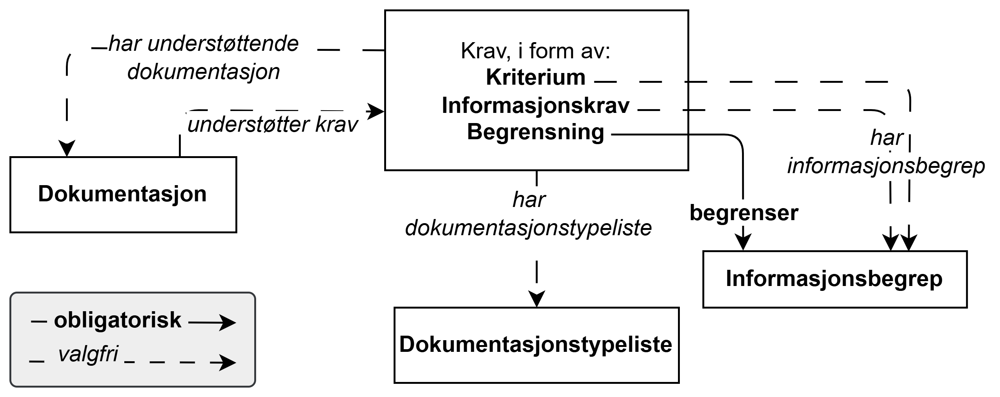

== Forenklet fremstilling av noen av kravene i CCCEV-AP-NO [[Forenklet-fremstilling]]

_Denne delen av spesifikasjonen er primært ment for den ikke-tekniske målgruppen._ 

:xrefstyle: short

<> viser en forenklet fremstilling av _noen_ av kravene i CCCEV-AP-NO. 

//:xrefstyle: pass:[%n %t]
:xrefstyle: full

[[img-ForenkletModell]]
.Forenklet fremstilling av noen av kravene i CCCEV-AP-NO
[link=images/CCCEV-AP-NO-forenklet-fremstilling.png]

Som figuren viser, kan CCCEV-AP-NO brukes til å beskrive

* Krav i form av *Kriterium*, *Informasjonskrav* eller *Begrensning*:
** *Kriterium* brukes til å oppgi betingelse(r) som må være oppfylt, f.eks. «Vilkår for å inngå ekteskap». 
** *Informasjonskrav* brukes til å oppgi data som forespøres og som skal dokumentere en eller flere fakta, eller som fører til kilden til slik dokumentasjon. Eksempel på et informasjonskrav kan være «Søkerens alder». 
*** For å kunne i maskinlesbar form beskrive dataene som forespørres, brukes Informasjonskrav sammen med *Informasjonsbegrep*, f.eks. «Alder».
** *Begrensning* brukes til å oppgi begrensning som gjelder for et informasjonsbegrep. For informasjonsbegrepet «Alder» kan en begrensning være «Søkeren må være minst 18 år gammel».
* *Dokumentasjon* brukes til, i «_run-time_», å oppgi den _faktiske_ dokumentasjonen som _er_ fremlagt og brukt til å evaluere om et krav er oppfylt eller ikke. Dokumentasjon brukes med andre ord i forbindelse med _utførelsen_ av en tjeneste, i f.eks. en saksbehandlings- eller arkiveringsapplikasjon. Eksempel på en faktisk dokumentasjon kan være «Uttrekk fra Folkeregisteret for Ola Nordmann».
* *Påkrevd dokumentasjon* brukes til, i «_design-time_», å oppgi den påkrevde dokumentasjonen som _kan_ fremlegges og brukes til å evaluere om et krav er oppfylt eller ikke. Påkrevd dokumentasjon brukes med andre ord i forbindelse med _beskrivelsen_ av en tjeneste, i f.eks. en tjenestekatalog. Eksempler på en påkrevd dokumentasjon på en søkers alder kan være «Uttrekk fra Folkeregisteret», «Fødselsattest» eller «Førerkort»/«ID-kort»/«Pass».

Se ellers <<[Når-brukes-kriterium-informasjonskrav-informasjonsbegrep-begrensning>> for mer forklaring på når Kriterium, Informasjonskrav eller Begrensning bør brukes.

Se også <<Å-beskrive-betingelser-som-skal-oppfylles>> og <<Å-kytte-krav-til-regelverk>> for illustrative eksempler på bruk av CCCEV-AP-NO.

Hvilke typer opplysninger som SKAL (obligatoriske), BØR (anbefalte) og KAN (valgfrie) tas med i en beskrivelse av et krav eller en dokumentasjon av kravoppfyllelse er nærmere spesifisert i det følgende i dette kapittelet. Hvordan opplysningene skal representeres teknisk i RDF (https://www.w3.org/RDF/[Resource Description Framework &#x29C9;, window="_blank", role="ext-link"]) er spesifisert i <<Spesifikasjon-per-klasse>>, som også innehlder flere klasser som kan brukes i tillegg til de som er vist i <> og beskrevet i dette kapittelet.

:xrefstyle: short

=== Hva SKAL, BØR og KAN tas med i en beskrivelse av Kriterium, Informasjonskrav og Begrensning? [[Krav-til-beskrivelse-av-kriterium-informasjonskrav-begrensning]]
For å sikre at *Kriterium*, *Informasjonskrav* og *Begrensning* blir beskrevet på en ensartet måte, inneholder tabellene typer opplysninger som SKAL (obligatoriske), BØR (anbefalte) eller KAN (valgfrie) tas med i beskrivelsene. I dette avsnittet brukes ordet «krav» som samlebetegnelse for alle tre typer krav: Kriterium, Informasjonskrav og Begrensning.

[[Tabell-obligatoriske-opplysninger-kriterium-informasjonskrav-begrensning]]
.Obligatoriske opplysningstyper som en beskrivelse av Kriterium, Informasjonskrav og Begrensning SKAL inneholde
[cols="20s,65d,15d", options="header"]
|===
| Obligatorisk | Forklaring | Ref. til Kap. <<Spesifikasjon-per-klasse>>
| identifikator | Unik identifikator, som regel opprettet automatisk av et system | <<Begrensning-identifikator>>, <<Informasjonskrav-identifikator>>, <<Kriterium-identifikator>>
| navn | Navn til kravet | <<Begrensning-navn>>, <<Informasjonskrav-navn>>, <<Kriterium-navn>>
| begrenser | _Gjelder kun Begrensning_. Refererer til informasjonsbegrep som begrensningen gjelder. | <<Begrensning-begrenser>>
|===

[[Tabell-anbefalte-opplysninger-kriterium-informasjonskrav-begrensning]]
.Anbefalte opplysningstyper som en beskrivelse av Kriterium, Informasjonskrav og Begrensning BØR inneholde
[cols="20s,65d,15d", options="header"]
|===
| Anbefalt | Forklaring | Ref. til Kap. <<Spesifikasjon-per-klasse>>
| beskrivelse | Tekstlig beskrivelse av kravet | <<Begrensning-beskrivelse>>, <<Informasjonskrav-beskrivelse>>, <<Kriterium-beskrivelse>>
|===

[[Tabell-valgfrie-opplysninger-kriterium-informasjonskrav-begrensning]]
.Valgfrie opplysningstyper som en beskrivelse av Kriterium, Informasjonskrav og Begrensning KAN inneholde
[cols="20s,65d,15d", options="header"]
|===
| Valgfri | Forklaring | Ref. til Kap. <<Spesifikasjon-per-klasse>>
| er subkrav av | Refererer til et annet krav som dette kravet er del av | <<Begrensning-er-subkrav-av>>, <<Informasjonskrav-er-subkrav-av>>, <<Kriterium-er-subkrav-av>>
| er utledet fra | Refererer til referanserammeverk som kravet er basert på, f.eks. lov, forskrift eller annen regulering | <<Begrensning-er-utledet-fra>>, <<Informasjonskrav-er-utledet-fra>>, <<Kriterium-er-utledet-fra>>
| er utstedt av | Refererer til aktøren som har utstedt kravet | <<Begrensning-er-utstedt-av>>, <<Informasjonskrav-er-utstedt-av>>, <<Kriterium-er-utstedt-av>>
| har dokumentasjonstypeliste | Refererer til dokumentasjonstypeliste som spesifiserer dokumentasjonstypene som trengs for å tilfredsstille kravet | <<Begrensning-har-dokumentasjonstypeliste>>, <<Informasjonskrav-har-dokumentasjonstypeliste>>, <<Kriterium-har-dokumentasjonstypeliste>>
| har kvalifisert relasjon til andre krav | En beskrevet/kategorisert relasjon til et annet krav | <<Begrensning-har-kvalifisert-relasjon-til-andre-krav>>,  <<Informasjonskrav-har-kvalifisert-relasjon-til-andre-krav>>, <<Kriterium-har-kvalifisert-relasjon-til-andre-krav>>
| har mer spesifikt krav | Refererer til et mer spesifikt krav som er del av dette kravet | <<Begrensning-har-mer-spesifikt-krav>>, <<Informasjonskrav-har-mer-spesifikt-krav>>, <<Kriterium-har-mer-spesifikt-krav>>
| har påkrevd dokumentasjon | Refererer til en påkrevd dokumentasjon som kan supplere med informasjon, bevis eller understøtte kravet | <<Begrensning-har-påkrevd-dokumentasjon>>, <<Informasjonskrav-har-påkrevd-dokumentasjon>>, <<Kriterium-har-påkrevd-dokumentasjon>>
| har understøttende dokumentasjon | Refererer til en konkret dokumentasjon som supplerer med informasjon, bevis eller understøtter kravet | <<Begrensning-har-understøttende-dokumentasjon>>, <<Informasjonskrav-har-understøttende-dokumentasjon>>, <<Kriterium-har-understøttende-dokumentasjon>>
| tilfredsstiller regel | Refererer til regel som kravet tilfredsstiller | <<Begrensning-innfrir-regel>>, <<Informasjonskrav-innfrir-regel>>, <<Kriterium-innfrir-regel>>
| type | Refererer til kategorien kravet tilhører | <<Begrensning-type>>, <<Informasjonskrav-type>>, <<Kriterium-type>>
| har informasjonsbegrep | _Gjelder Kriterium eller Informasjonskrav_. Refererer til informasjonsbegrep som Informasjonskravet eller Kriteriet forventer en verdi av | <<Informasjonskrav-har-informasjonsbegrep>>, <<Kriterium-har-informasjonsbegrep>>
| bias | _Gjelder kun Kriterium_. Oppgir parameteren som brukes til å justere evalueringen av Kriteriet | <<Kriterium-bias>>
| vekting | _Gjelder kun Kriterium_. Oppgir relativ viktighet (vekting) av Kriteriet | <<Kriterium-vekting>>
| vektingstype | _Gjelder kun Kriterium_. Oppgir  hvordan vektingen bør tolkes i et komplekst evalueringsuttrykk, f.eks. som en prosent i et evalueringsuttrykk | <<Kriterium-vektingstype>>
| vektingsvurderingsbeskrivelse | _Gjelder kun Kriterium_. Oppgir en tekstlig forklaring på hvordan vektingen av Kriteriet brukes Kriteriet | <<Kriterium-vektingsvurderingsbeskrivelse>>
|===

=== Hva SKAL, BØR og KAN tas med i en beskrivelse av Informasjonsbegrep [[Krav-til-beskrivelse-av-informasjonsbegrep]]
For å sikre at *Informasjonsbegrep* blir beskrevet på en ensartet måte, inneholder tabellene typer opplysninger som SKAL (obligatoriske), BØR (anbefalte) eller KAN (valgfrie) tas med i beskrivelsene.

[[Tabell-obligatoriske-opplysninger-informasjonsbegrep]]
.Obligatoriske opplysningstyper som en beskrivelse av Informasjonsbegrep SKAL inneholde
[cols="20s,65d,15d", options="header"]
|===
| Obligatorisk | Forklaring | Ref. til Kap. <<Spesifikasjon-per-klasse>>
| forventet verdi | Angir forventet datatype for verdien til informasjonsbegrepet (f.eks. heltall, dato eller kode) | <<Informasjonsbegrep-uttrykk-av-forventet-verdi>>
|===

[[Tabell-anbefalte-opplysninger-informasjonsbegrep]]
.Anbefalte opplysningstyper som en beskrivelse av Informasjonsbegrep BØR inneholde
[cols="20s,65d,15d", options="header"]
|===
| Anbefalt | Forklaring | Ref. til Kap. <<Spesifikasjon-per-klasse>>
| beskrivelse | Tekstlig beskrivelse av informasjonsbegrepet | <<Informasjonsbegrep-beskrivelse>>
|===

[[Tabell-valgfrie-opplysninger-informasjonsbegrep]]
.Valgfrie opplysningstyper som en beskrivelse av Informasjonsbegrep KAN inneholde
[cols="20s,65d,15d", options="header"]
|===
| Valgfri | Forklaring | Ref. til Kap. <<Spesifikasjon-per-klasse>>
| identifikator | Unik identifikator, som regel opprettet automatisk av et system | <<Informasjonsbegrep-identifikator>>
| navn | Navnet til informasjonsbegrepet | <<Informasjonsbegrep-navn>>
| type | Kategori informasjonsbegrepet tilhører | <<Informasjonsbegrep-type>>
|===

=== Hva SKAL, BØR og KAN tas med i en beskrivelse av Dokumentasjon [[Krav-til-beskrivelse-av-dokumentasjon]]
For å sikre at *Dokumentasjon* blir beskrevet på en ensartet måte, inneholder tabellene typer opplysninger som SKAL (obligatoriske), BØR (anbefalte) eller KAN (valgfrie) tas med i beskrivelsene.

[[Tabell-obligatoriske-opplysninger-dokumentasjon]]
.Obligatoriske opplysningstyper som en beskrivelse av Dokumentasjon SKAL inneholde
[cols="20s,65d,15d", options="header"]
|===
| Obligatorisk | Forklaring | Ref. til Kap. <<Spesifikasjon-per-klasse>>
| identifikator | Unik identifikator, som regel opprettet automatisk av et system | <<Dokumentasjon-identifikator>>
| navn | Det offisielle navnet til dokumentasjonen | <<Dokumentasjon-navn>>
|===

[[Tabell-anbefalte-opplysninger-dokumentasjon]]
.Anbefalte opplysningstyper som en beskrivelse av Dokumentasjon BØR inneholde
[cols="20s,65d,15d", options="header"]
|===
| Anbefalt | Forklaring | Ref. til Kap. <<Spesifikasjon-per-klasse>>
| beskrivelse | Tekstlig beskrivelse av dokumentasjonen | <<Dokumentasjon-beskrivelse>>
| språk | Språket dokumentasjonen er skrevet på | <<Dokumentasjon-språk>>
|===

[[Tabell-valgfrie-opplysninger-dokumentasjon]]
.Valgfrie opplysningstyper som en beskrivelse av Dokumentasjon KAN inneholde
[cols="20s,65d,15d", options="header"]
|===
| Valgfri | Forklaring | Ref. til Kap. <<Spesifikasjon-per-klasse>>
| er del av | Refererer til et datasett som den aktuelle dokumentasjonen fysisk eller logisk er inkludert i | <<Dokumentasjon-er-del-av>>
| distributør | Oppgir aktør som sender dokumentasjonen | <<Dokumentasjon-distributør>>
| gir understøttende opplysning | Refererer til understøttende opplysninger i dokumentasjonen | <<Dokumentasjon-gir-understøttende-opplysning>>
| gjelder | Oppgir aktøren som dokumentasjonen gjelder for | <<Dokumentasjon-gjelder>>
| gyldighetsperiode | Angir en tidsperiode hvor dokumentasjonen er gyldig | <<Dokumentasjon-gyldighetsperiode>>
| i samsvar med | Oppgir dokumentasjonstypen som dokumentasjonen er i samsvar med | <<Dokumentasjon-i-samsvar-med>>
| konfidensialitetsnivå | Oppgir dokumentasjonens sikkerhetsklassifisering, f.eks. klassifisert, sensitiv, offentlig | <<Dokumentasjon-konfidensialitetsnivå>>
| produsent | Oppgir aktøren som som er produsent av dokumentasjonen | <<Dokumentasjon-produsent>>
| relatert informasjon | Refererer til mer informasjon om dokumentasjonen, f.eks. en bestemt mal til et administrativt dokument eller en applikasjon, eller en veiledning for hvordan man skal formatere dokumentasjonen | <<Dokumentasjon-relatert-informasjon>>
| type | Refererer til begrepet som representerer typen dokumentasjonen tilhører | <<Dokumentasjon-type>>
| understøtter informasjonsbegrep | Refererer til informasjonsbegrep som gir fakta funnet eller utledet fra dokumentasjonen | <<Dokumentasjon-understøtter-informasjonsbegrep>>
| understøtter krav | Refererer til krav som dokumentasjonen understøtter | <<Dokumentasjon-understøtter-krav>>
| utsteder | Oppgir aktøren som er juridisk ansvarlig for dokumentasjonen | <<Dokumentasjon-utsteder>>
|===

=== Hva SKAL, BØR og KAN tas med i en beskrivelse av Påkrevd dokumentasjon [[Krav-til-beskrivelse-av-påkrevd-dokumentasjon]]
For å sikre at *Påkrevd dokumentasjon* blir beskrevet på en ensartet måte, inneholder tabellene typer opplysninger som SKAL (obligatoriske), BØR (anbefalte) eller KAN (valgfrie) tas med i beskrivelsene.

[[Tabell-obligatoriske-opplysninger-påkrevd-dokumentasjon]]
.Obligatoriske opplysningstyper som en beskrivelse av Påkrevd dokumentasjon SKAL inneholde
[cols="20s,65d,15d", options="header"]
|===
| Obligatorisk | Forklaring | Ref. til Kap. <<Spesifikasjon-per-klasse>>
| beskrivelse | Tekstlig beskrivelse av den påkrevde dokumentasjonen | <<PåkrevdDokumentasjon-beskrivelse>>
| navn | Det offisielle navnet til den påkrevde dokumentasjonen | <<PåkrevdDokumentasjon-navn>>
|===

[[Tabell-anbefalte-opplysninger-påkrevd-dokumentasjon]]
.Anbefalte opplysningstyper som en beskrivelse av Påkrevd dokumentasjon BØR inneholde
[cols="20s,65d,15d", options="header"]
|===
| Anbefalt | Forklaring | Ref. til Kap. <<Spesifikasjon-per-klasse>>
| gyldighetsperiode | Angir en tidsperiode hvor den påkrevde dokumentasjonen er gyldig | <<PåkrevdDokumentasjon-gyldighetsperiode>>
| språk | Språket den påkrevde dokumentasjonen er skrevet på | <<PåkrevdDokumentasjon-språk>>
|===

[[Tabell-valgfrie-opplysninger-påkrevd-dokumentasjon]]
.Valgfrie opplysningstyper som en beskrivelse av Påkrevd dokumentasjon KAN inneholde
[cols="20s,65d,15d", options="header"]
|===
| Valgfri | Forklaring | Ref. til Kap. <<Spesifikasjon-per-klasse>>
| er del av | Refererer til et datasett som den aktuelle påkrevde dokumentasjonen fysisk eller logisk er inkludert i | <<PåkrevdDokumentasjon-er-del-av>>
| gir understøttende opplysning | Refererer til understøttende opplysninger i den påkrevde dokumentasjonen | <<PåkrevdDokumentasjon-gir-understøttende-opplysning>>
| identifikator | Unik identifikator, som regel opprettet automatisk av et system | <<PåkrevdDokumentasjon-identifikator>>
| i samsvar med | Oppgir dokumentasjonstypen som den påkrevde dokumentasjonen er i samsvar med | <<PåkrevdDokumentasjon-i-samsvar-med>>
| relatert informasjon | Refererer til mer informasjon om den påkrevde dokumentasjonen, f.eks. en bestemt mal til et administrativt dokument eller en applikasjon, eller en veiledning for hvordan man skal formatere den påkrevde dokumentasjonen | <<PåkrevdDokumentasjon-relatert-informasjon>>
| type | Refererer til begrepet som representerer typen den påkrevde dokumentasjonen tilhører | <<PåkrevdDokumentasjon-type>>
| understøtter informasjonsbegrep | Refererer til informasjonsbegrep som gir fakta funnet eller utledet fra den påkrevde dokumentasjonen | <<PåkrevdDokumentasjon-understøtter-informasjonsbegrep>>
| understøtter krav | Refererer til krav som den påkrevde dokumentasjonen understøtter | <<PåkrevdDokumentasjon-understøtter-krav>>
|===
