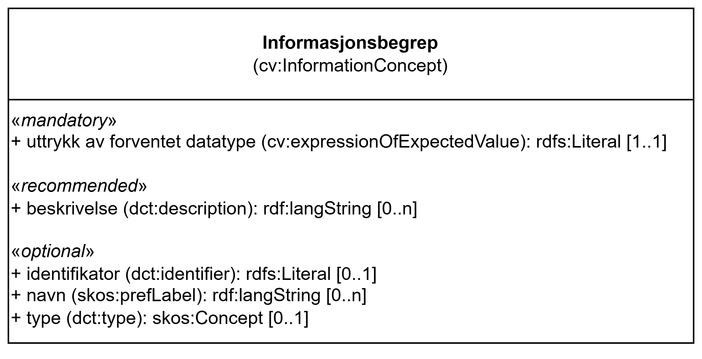

== Klassen Informasjonsbegrep (cv:InformationConcept) [[Informasjonsbegrep]]

[[img-KlassenInformasjonsbegrep]]
.Klassen Informasjonsbegrep (cv:InformationConcept)
[link=images/KlassenInformasjonsbegrep.png]

[cols="30s,70d"]
|===
| _English name_ |  _Information Concept_
| Anvendelse / _Usage note_ |  Klassen brukes til å representere en del av informasjonen som dokumentasjonen gir eller som kravet trenger. Klassen tilbyr muligheten til å beskrive kravene konseptuelt og oppgitte fakta i dokumentasjon. Dette er et (første) skritt mot å tilrettelegge for vurderingen av kravene på en automatisert måte basert på dokumentasjonen som er gitt.

_This class represents a piece of information that the Evidence provides or the Requirement needs. The Information Concept class offers the ability to describe conceptually the Requirements and provided facts in Evidences. This is a (first) step towards facilitating the assessment of the requirements in an automated way based on the Evidence provided._
| URI |  cv:InformationConcept
| Eksempel | Se under kap. <<Å-beskrive-betingelser-som-skal-oppfylles>>.
|===

Eksempel i RDF Turtle: Se under kap. <<Å-beskrive-betingelser-som-skal-oppfylles>>.

=== Obligatoriske egenskaper for klassen _Informasjonsbegrep_ [[Informasjonsbegrep-obligatoriske-egenskaper]]

==== Informasjonsbegrep – uttrykk av forventet datatype (cv:expressionOfExpectedValue) [[Informasjonsbegrep-uttrykk-av-forventet-datatype]]

[cols="30s,70d"]
|===
| _English name_ | _expression of expected value_
| URI | cv:expressionOfExpectedValue
| Verdiområde / _Range_ | rdfs:Literal
| Anvendelse / _Usage note_ | Egenskapen brukes til å oppgi forventet datatype for informasjonsbegrepet formulert i et formelt språk, som understøttende opplysninger må samsvare, f.eks. `xsd:decimal` (for «desimaltall»), `xsd:date` (for «dato») eller `skos:Concept` (for «kode»). 

_This property represents a formulation in a formal language of the expected datatype for the Information Concept which is aligned with the concepts from the Requirements defined and must be respected by the supplied Supported Values._
| Multiplisitet / _Multiplicity_ | 1..1
| Kravnivå / _Requirement level_ | Obligatorisk / _Mandatory_
| Merknad 1 / _Note 1_ | Norsk utvidelse: Kravnivået endret fra valgfri til obligatorisk, og multiplisiteten fra 0..n til 1..1.

_Norwegian extension: The requirement level changed from optional to mandatory, and the multiplicity from 0..n to 1..1._
| Merknad 2 / _Note 2_ | Norsk utvidelse: Selv om CCCEV (foreløpig) forklarer at denne egenskapen også kan brukes til å oppgi nedre og øvre grenser for verdier (f.eks. «maksimum verdi er 1 million euro»), anbefales det i denne norske spesifikasjonen at denne egenskapen bare brukes til å oppgi forventet datatype (f.eks. «desimaltall (`xsd:decimal`)»). For å angi grenser for verdier anbefales det å bruke <<Begrensning>>.

__Norwegian extension: Although CCCEV (currently) explains that this property can also be used to specify lower and upper bounderaries for values (e.g., "the maximum value is 1 Million Euro"), it is recommended in this Norwegian specification that this property is only used to specify the expected data type (e.g., "decimal numbers (`xsd:decimal`)"). To specify value bounderaries, it is recommended to use <<Begrensning, Constraint>>.__
|===

=== Anbefalte egenskaper for klassen _Informasjonsbegrep_ [[Informasjonsbegrep-anbefalte-egenskaper]]

==== Informasjonsbegrep – beskrivelse (dct:description) [[Informasjonsbegrep-beskrivelse]]

[cols="30s,70d"]
|===
| _English name_ | _description_
| URI | dct:description
| Verdiområde / _Range_ | rdf:langString
| Anvendelse / _Usage note_ | Egenskapen brukes til å oppgi en tekstlig beskrivelse av informasjonsbegrepet. F.eks. informasjon om begrepets art, egenskaper, bruk eller annen tilleggsinformasjon om begrepet. Egenskapen BØR gjentas når beskrivelsen finnes på flere språk.

_This property represents a short explanation supporting the understanding of the Information Concept. The explanation can include information about the nature, attributes, uses or any other additional information about the Information Concept. This property SHOULD be repeated when the description is in parallel languages._
| Multiplisitet / _Multiplicity_ | 0..n
| Kravnivå / _Requirement level_ | Anbefalt / _Recommended_
| Merknad / _Note_ | Norsk utvidelse: Kravnivået endret fra valgfri til anbefalt, og verdiområdet fra 'xsd:string' til 'rdf:langString'.

_Norwegian extension: The requirement level changed from optional to recommended, and the range from 'xsd:string' to 'rdf:langString'._
|===

=== Valgfrie egenskaper for klassen _Informasjonsbegrep_ [[Informasjonsbegrep-valgfrie-egenskaper]]

==== Informasjonsbegrep – identifikator (dct:identifier) [[Informasjonsbegrep-identifikator]]

[cols="30s,70d"]
|===
| _English name_ | _identifier_
| URI | dct:identifier
| Verdiområde / _Range_ | rdfs:Literal
| Anvendelse / _Usage note_ | Egenskapen brukes til å oppgi identifikatoren til informasjonsbegrepet.

_This property represents an unambiguous reference to the Information Concept._
| Multiplisitet / _Multiplicity_ | 0..1
| Kravnivå / _Requirement level_ | Valgfri / _Optional_
|===

==== Informasjonsbegrep – navn (skos:prefLabel) [[Informasjonsbegrep-navn]]

[cols="30s,70d"]
|===
| _English name_ | _name_
| URI | skos:prefLabel
| Verdiområde / _Range_ | rdf:langString
| Anvendelse / _Usage note_ | Egenskapen brukes til å oppgi navnet til informasjonsbegrepet. Egenskapen BØR gjentas når navnet finnes på flere språk.

_This property represents the Name of the Information Concept. The property SHOULD be repeated when the name is in several languages._
| Multiplisitet / _Multiplicity_ | 0..n
| Kravnivå / _Requirement level_ | Valgfri / _Optional_
|Merknad / _Note_ |   Norsk utvidelse: Verdiområdet endret fra 'xsd:string' til 'rdf:langString'.

_Norwegian extension: The range changed from 'xsd:string' to 'rdf:langString'._
|===

==== Informasjonsbegrep – type (dct:type) [[Informasjonsbegrep-type]]

[cols="30s,70d"]
|===
| _English name_ | _type_
| URI | dct:type
| Verdiområde / _Range_ | skos:Concept
| Anvendelse / _Usage note_ | Egenskapen brukes til å spesifisere hvilken kategori informasjonsbegrepet tilhører.

_This property represents the category to which the Information Concept belongs._
| Multiplisitet / _Multiplicity_ | 0..1
| Kravnivå / _Requirement level_ | Valgfri / _Optional_
|Merknad / _Note_ | Norsk utvidelse: Selv om CCCEV (foreløpig) forklarer at denne egenskapen også kan brukes til å oppgi primitive typer som f.eks. dato eller tekststreng, anbefales det i denne norske spesifikasjonen at denne egenskapen brukes bare for forretningsmessige domeneterminologier som «alder» eller «antall ansatte», og at egenskapen <<Informasjonsbegrep-uttrykk-av-forventet-datatype>> brukes til primitive datatyper. 

__Norwegian extension: Although CCCEV (currently) explains that this property can also be used to specify primitive types such as date or string, it is recommended in this Norwegian specification that this property is only used for business domain terminology such as "age" or "number of employees" and the property <<Informasjonsbegrep-uttrykk-av-forventet-datatype, expression of the expected value (cv:expressionOfExpectedValue)>> for primitive types.__
|===
