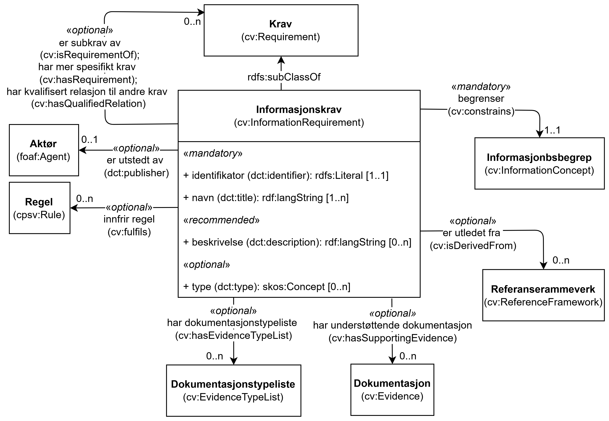

== Klassen Informasjonskrav (cv:InformationRequirement) [[Informasjonskrav]]

[[img-KlassenInformasjonskrav]]
.Klassen Informasjonskrav (cv:InformationRequirement) og klassene den refererer til 
[link=images/KlassenInformasjonskrav.png]

[cols="30s,70d"]
|===
| _English name_ | _Information Requirement_
| Anvendelse / _Usage note_ |  Klassen brukes til å representere forespørsler om data som skal dokumentere en eller flere fakta (fra den virkelige verden) på en formell måte, eller som fører til kilden til slik dokumentasjon.

_This class represents requested data that is to be proven by Evidence._

_Information Requirements are the most neutral kind of Requirements. They aim to request information in any form, e.g. a person's date of birth or a company's turnover. They represent requests for data that prove one or more facts of the real world in a formal manner, or that leads to the source of such a proof. They can be understood as 'requests for Evidences'. The response to an Information Requirement is an Evidence when the issuer of the response is an authoritative source (e.g. a Civil Registry providing data about a natural person for the provision of public service through the Single Digital Gateway). In other cases, the responses might not be issued by an authoritative source, but the issuer supports the responses with Evidences (or commits to support them timely, e.g. a self-declaration or a declaration of oath). The Information Requirement can require structured data or documents of any form. For structured data, the Requirement can use 'Concepts' to specify the structure and type of the data expected in the response. For both structured and unstructured data, the Information Requirement can indicate the expected Type of Evidence, its format, source, and other properties related to the Evidence._
| URI |  cv:InformationRequirement
| Subklasse av / _Subclass of_ | <<Krav, cv:Requirement>>
| Eksempel | Se under kap. <<Å-beskrive-betingelser-som-skal-oppfylles>>.
|===

Eksempel i RDF Turtle: Se under kap. <<Å-beskrive-betingelser-som-skal-oppfylles>>.

=== Obligatoriske egenskaper for klassen _Informasjonskrav_ [[Informasjonskrav-obligatoriske-egenskaper]]

==== Informasjonskrav – identifikator (dct:identifier) [[Informasjonskrav-identifikator]]

[cols="30s,70d"]
|===
| _English name_ | _identifier_
| URI | dct:identifier
| Verdiområde / _Range_ | rdfs:Literal
| Anvendelse / _Usage note_ |  Egenskapen brukes til å oppgi identifikatoren til informasjonskravet.

_This property represents an identifier for the Information Requirement._
| Multiplisitet / _Multiplicity_ | 1..1
| Kravnivå / _Requirement level_ | Obligatorisk / _Mandatory_
|===

==== Informasjonskrav – navn (dct:title) [[Informasjonskrav-navn]]

[cols="30s,70d"]
|===
| _English name_ | _name_
| URI | dct:title
| Verdiområde / _Range_ | rdf:langString
| Anvendelse / _Usage note_ |  Egenskapen brukes til å oppgi navn til informasjonskravet. Egenskapen BØR gjentas når navnet er på flere språk.

_This property represents the official Name of the Information Requirement. This property SHOULD be repeated when the name is in several languages._
| Multiplisitet / _Multiplicity_ | 1..n
| Kravnivå / _Requirement level_ | Obligatorisk / _Mandatory_
|===

=== Anbefalte egenskaper for klassen _Informasjonskrav_ [[Informasjonskrav-anbefalte-egenskaper]]

==== Informasjonskrav – beskrivelse (dct:description) [[Informasjonskrav-beskrivelse]]

[cols="30s,70d"]
|===
| _English name_ | _description_
| URI | dct:description
| Verdiområde / _Range_ | rdf:langString
| Anvendelse / _Usage note_ |  Egenskapen brukes til å oppgi beskrivelse av informasjonskravet. Egenskapen BØR gjentas når beskrivelsen er på flere språk.

_This property represents a description of the Information Requirement. This property SHOULD be repeated when the description is in several languages._
| Multiplisitet / _Multiplicity_ | 0..n
| Kravnivå / _Requirement level_ | Anbefalt / _Recommended_
|===

=== Valgfrie egenskaper for klassen _Informasjonskrav_ [[Informasjonskrav-valgfrie-egenskaper]]

==== Informasjonskrav – er subkrav av (cv:isRequirementOf) [[Informasjonskrav-er-subkrav-av]]

[cols="30s,70d"]
|===
| _English name_ | _is requirement of_
| URI |  cv:isRequirementOf
| Verdiområde / _Range_ | <<Krav, cv:Requirement>>
| Anvendelse / _Usage note_ |  Egenskapen brukes til å referere til et annet krav som informasjonskravet er en del av, representert ved en instans av en av subklassene til klassen Krav (`cv:Requirement`).

_This property is used to refer to an instance of one of the subclasses of `cv:Requirement`, which the Information Requirement is a part of._
| Multiplisitet / _Multiplicity_ | 0..n
| Kravnivå / _Requirement level_ |  Valgfri / _Optional_
|===

==== Informasjonskrav – er utledet fra (cv:isDerivedFrom) [[Informasjonskrav-er-utledet-fra]]

[cols="30s,70d"]
|===
| _English name_ | _is derived from_
| URI |  cv:isDerivedFrom
| Verdiområde / _Range_ | <<Referanserammeverk, cv:ReferenceFramework>>
| Anvendelse / _Usage note_ |  Egenskapen brukes til å referere til referanserammeverk som informasjonskravet er basert på, f.eks. lov, forskrift eller annen regulering.

_This property refers to the Reference Framework on which the Information Requirement is based, such as a law or regulation._

_Note that an Information Requirement can have several Reference Frameworks from which it is derived._
| Multiplisitet / _Multiplicity_ | 0..n
| Kravnivå / _Requirement level_ | Valgfri / _Optional_
|===

==== Informasjonskrav – er utstedt av (dct:publisher) [[Informasjonskrav-er-utstedt-av]]

[cols="30s,70d"]
|===
| _English name_ | _is issued by_
| URI |  dct:publisher
| Verdiområde / _Range_ | https://data.norge.no/specification/cpsv-ap-no#Aktør[foaf:Agent &#x29C9;, window="_blank", role="ext-link"]
| Anvendelse / _Usage note_ |  Egenskapen brukes til å referere til aktøren som har utstedt informasjonskravet.

_This property refers to the Agent that has published the Information Requirement._
| Multiplisitet / _Multiplicity_ | 0..1
| Kravnivå / _Requirement level_ | Valgfri / _Optional_
|===

==== Informasjonskrav – har dokumentasjonstypeliste (cv:hasEvidenceTypeList) [[Informasjonskrav-har-dokumentasjonstypeliste]]

[cols="30s,70d"]
|===
| _English name_ | _has evidence type list_
| URI |  cv:hasEvidenceTypeList
| Verdiområde / _Range_ | <<Dokumentasjonstypeliste, cv:EvidenceTypeList>>
| Anvendelse / _Usage note_ |  Egenskapen brukes til å referere til dokumentasjonstypeliste som spesifiserer type dokumentasjon som trengs for å tilfredsstille informasjonskravet.

_This property is used to refer to the Evidence Type List that specifies the type of evidence that are needed to meet the Information Requirement._
| Multiplisitet / _Multiplicity_ | 0..n
| Kravnivå / _Requirement level_ | Valgfri / _Optional_
|===

==== Informasjonskrav – har kvalifisert relasjon til andre krav (cv:hasQualifiedRelation) [[Informasjonskrav-har-kvalifisert-relasjon-til-andre-krav]]

[cols="30s,70d"]
|===
| _English name_ | _has qualified relation_
| URI |  cv:hasQualifiedRelation
| Verdiområde / _Range_ | <<Krav, cv:Requirement>>
| Anvendelse / _Usage note_ |  Egenskapen brukes til å representere en beskrevet/kategorisert relasjon til et annet krav, representert ved en instans av en av subklassene til klassen Krav (`cv:Requirement`).

_This property represents a described and/or categorised relation to an instance of one of the subclasses of `cv:Requirement`._
| Multiplisitet / _Multiplicity_ | 0..n
| Kravnivå / _Requirement level_ | Valgfri / _Optional_
|===

==== Informasjonskrav – har mer spesifikt krav (cv:hasRequirement) [[Informasjonskrav-har-mer-spesifikt-krav]]

[cols="30s,70d"]
|===
| _English name_ | _has requirement_
| URI |  cv:hasRequirement
| Verdiområde / _Range_ | <<Krav, cv:Requirement>>
| Anvendelse / _Usage note_ |  Egenskapen brukes til å referere til et mer spesifikt krav som er en del av informasjonskravet, representert ved en instans av en av subklassene til klassen Krav (`cv:Requirement`).

_This property refers to a more specific Requirement that is part of the Information Requirement._
| Multiplisitet / _Multiplicity_ | 0..n
| Kravnivå / _Requirement level_ | Valgfri / _Optional_
|===

==== Informasjonskrav – har understøttende dokumentasjon (cv:hasSupportingEvidence) [[Informasjonskrav-har-understøttende-dokumentasjon]]

[cols="30s,70d"]
|===
| _English name_ | _has supporting evidence_
| URI |  cv:hasSupportingEvidence
| Verdiområde / _Range_ | <<Dokumentasjon, cv:Evidence>>
| Anvendelse / _Usage note_ | Egenskapen brukes til å referere til en konkret dokumentasjon som supplerer med informasjon, bevis eller understøtter informasjonskravet.

_This property refers to a concrete piece of evidence that supplies information, proof or support for the information requirement._
| Multiplisitet / _Multiplicity_ | 0..n
| Kravnivå / _Requirement level_ | Valgfri / _Optional_
|===

==== Informasjonskrav – innfrir regel (cv:fulfils) [[Informasjonskrav-innfrir-regel]]

[cols="30s,70d"]
|===
| _English name_ | _fulfils_
| URI |  cv:fulfils
| Verdiområde / _Range_ | https://data.norge.no/specification/cpsv-ap-no#Regel[cpsv:Rule &#x29C9;, window="_blank", role="ext-link"]
| Anvendelse / _Usage note_ |  Egenskapen brukes til å referere til regel som informasjonskravet innfrir.

_This property refers to the rules that the Information Requirement fulfils._
| Multiplisitet / _Multiplicity_ | 0..n
| Kravnivå / _Requirement level_ | Valgfri / _Optional_
|===

==== Informasjonskrav – type (dct:type) [[Informasjonskrav-type]]

[cols="30s,70d"]
|===
| _English name_ | _type_
| URI | dct:type
| Verdiområde / _Range_ | skos:Concept
| Anvendelse / _Usage note_ |  Egenskapen brukes til å referere til kategorien informasjonskravet tilhører.

_This property refers to the category to which the Information Requirement belongs._
| Multiplisitet / _Multiplicity_ | 0..n
| Kravnivå / _Requirement level_ | Valgfri / _Optional_
|===
