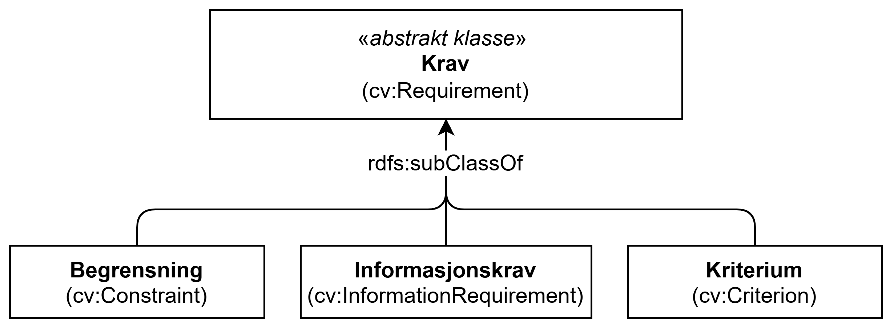

== Klassen Krav (cv:Requirement) [[Krav]]

[[img-KlassenKrav]]
.Klassen Krav (cv:Requirement) og dens subklasser
[link=images/KlassenKrav-AbstraktKlasse.png]

[cols="30s,70d"]
|===
| _English name_ | _Requirement_
| Anvendelse / _Usage note_ | Klassen brukes til å representere nødvendige betingelser eller forutsetninger for bruk av en tjeneste.

_The class represents condition or prerequisite._

_Not all public services are needed or are used by everyone. For example, the visa service operated by European countries is not needed by European citizens but is needed by some citizens from elsewhere, or public services offering unemployment benefits and grants are targeting specific societal groups._
| URI | cv:Requirement
| Merknad / _Note_ | Denne klassen er en generisk klasse som frarådes å brukes direkte. Dens subklasse <<Begrensning>>, <<Kriterium>> eller <<Informasjonskrav>> BØR brukes istedenfor. 

__Requirement is a generic class representing any type of prerequisite that may be desired, needed or imposed as an obligation. CCCEV recommends to not use the Requirement class directly, but rather a more semantically-enriched subclass such as <<Kriterium, Criterion>>, <<Informasjonskrav, Information Requirement>> or <<Begrensning,Constraint>>. Also note that the Requirement class is specified at a more abstract level and is not to be used as the instantiation of a Requirement for a specific Agent. To illustrate the notion: the European Directive on services in the internal market defines requirement as any obligation, prohibition, condition or limit provided for in the laws, regulations or administrative provisions of the Member States or in consequence of case-law, administrative practice, the rules of professional bodies, or the collective rules of professional associations or other professional organisations, adopted in the exercise of their legal autonomy.__
|===

[IMPORTANT] 
Som nevnt ovenfor er denne klassen en generisk klasse (også kalt abstrakt klasse) som ikke bør brukes direkte. En av subklassene – <<Begrensning>>, <<Kriterium>> eller <<Informasjonskrav>> – bør brukes istedenfor, avhengig av konteksten.
