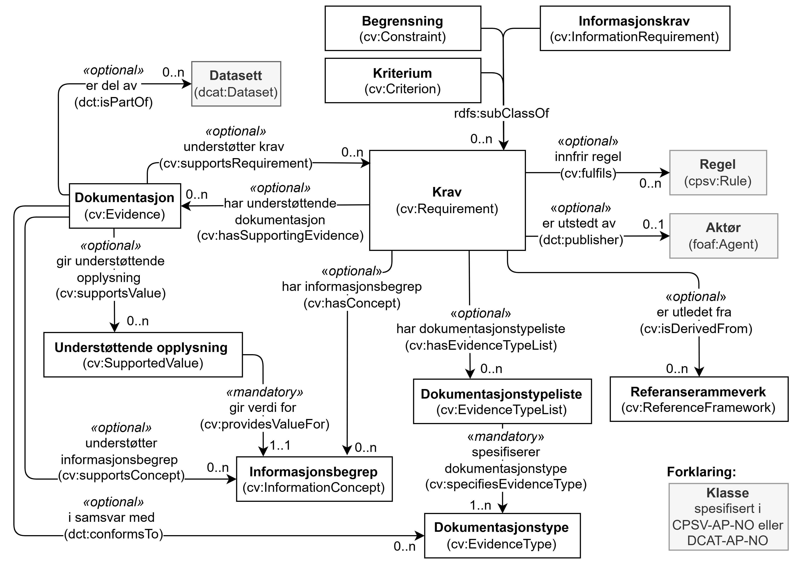

== Krav til RDF-representasjon av klassene i CCCEV-AP-NO [[Spesifikasjon-per-klasse]]

_Denne delen av spesifikasjonen er primært ment for den tekniske målgruppen og forutsetter kjennskap til RDF._ 

:xrefstyle: short

<> viser en visuell oversikt over klassene i CCCEV-AP-NO og relasjoner mellom dem. I figuren er klassene som er spesifisert i https://data.norge.no/specification/cpsv-ap-no[Spesifikasjon for tjeneste- og hendelsesbeskrivelser (CPSV-AP-NO) &#x29C9;, window="_blank", role="ext-link"] og som blir referert til fra denne spesifikasjonen markert med grå bakgrunn.

[[img-KlasseOversikt]]
.Klassene i CCCEV-AP-NO
[link=images/CCCEV-AP-NO-klasser.png]

//:xrefstyle: pass:[%n %t]
:xrefstyle: full

Figuren er ikke ment som en formell representasjon av spesifikasjonen. Før eventuell uoverensstemmelse mellom figuren og den tekstlige beskrivelsen blir rettet opp, har den tekstlige beskrivelsen forrang. Samme forrang gjelder også når det gjelder eventuelle uoverensstemmelser mellom tekstlige beskrivelser og figurer i resten av spesifikasjonen. 

Klassene markert med grå bakgrunn i figuren er spesifisert andre steder: Datasett (`dcat:Dataset`) i https://data.norge.no/specification/dcat-ap-no[DCAT-AP-NO &#x29C9;, window="_blank", role="ext-link"]; Regel (`cpsv:Rule`) og Aktør (`foaf:Agent`) i https://data.norge.no/specification/cpsv-ap-no[CPSV-AP-NO &#x29C9;, window="_blank", role="ext-link"]. Klassene med hvit bakgrunn er spesifisert videre i dette kapitlet. Klassene er sortert alfabetisk etter norske klassenavn, og egenskapene i hver klasse gruppert først inn i obligatoriske, anbefalte og valgfrie egenskaper, og der under alfabetisk etter norske egenskapsnavn. 

Kravene i denne delen av spesifikasjonen spesifiserer hvordan beskrivelsene skal representeres i RDF. Hvert krav er spesifisert i en tabell som inneholder syntaks og forklaring. Radene i tabellene er beskrevet nedenfor. Noen tabeller har færre rader. Engelske navn og tekster som er tatt med i tabellene, er ikke alle nødvendigvis ordrette sitater fra engelske kilder. Vi kan ha valgt en annen engelsk tekst til å formidle det samme budskapet, med mindre vi eksplisitt sier at det er et avvik. 

«Norsk utvidelse» i merknad er endringer som er gjort i denne spesifikasjonen sammenlignet med EUs CCCEV og måten CCCEV er brukt i EUs CPSV-AP. Der det ikke står noe om «norsk utvidelse» i merknad til en egenskap/klasse, er egenskapen/klassen brukt slik den er spesifisert i CCCEV og/eller brukt i CPSV-AP. Der det står «norsk utvidelse» i merknad til en egenskap, er kravet til egenskapen endret (f.eks. med forklaringen noe a la «Kravnivået er endret fra valgfri til anbefalt»), eller at egenskapen ikke er å finne i CCCEV/CPSV-AP (f.eks. med forklaring «Ikke eksplisitt spesifisert i CCCEV/CPSV-AP.»). 

[cols="30s,70"]
|===
| Ledetekst i tabellen | *Hensikt med raden i tabellen*
| _English name_ | Brukes til å angi klasse- eller egenskapsnavn på engelsk, primært ment for engelsktalende utviklere av verktøystøtte.
| URI | Brukes til å angi en unik identifikator til klassen eller egenskapen.

Det er dette som skal benyttes i RDF-basert utveksling/tilgjengeliggjøring av beskrivelser som er utformet i henhold til denne standarden.

Eksempel: `skos:Concept` er identifikatoren til klassen Begrep (Concept), slik klassen er spesifisert i `skos` (<<Navnerom>> viser hva `skos` står for).
| Subklasse av / _Subclass of_ | Denne brukes bare i spesifikasjon av en klasse, til å referere til klassen som den aktuelle klassen ev. er subklasse av. 
| Subegenskap av / _Subproperty of_ | Denne brukes bare i spesifikasjon av en egenskap, til å referere til egenskapen som den aktuelle egenskapen ev. er subegenskap av. 
| Verdiområde / _Range_ | Denne brukes bare i spesifikasjon av en egenskap, til å spesifisere lovlige verdier. Disse angis ved henvisning til en klasse eller datatype.

Eksempel: Verdiområde `skos:Concept` betyr at verdien til egenskapen skal være en instans av klassen `skos:Concept`.
|Anvendelse / _Usage note_ | Brukes til å forklare hva klassen eller egenskapen er ment å brukes til, i kontekst av denne standarden. Forklaringen er også skrevet på engelsk (_Usage note_, kursivert), primært ment for engelsktalende utviklere av verktøystøtte.
| Multiplisitet / _Multiplicity_ | Denne brukes bare i spesifikasjon av en egenskap, til å spesifisere minimum og maksimum antall verdier egenskapen SKAL/BØR/KAN ha.
| Kravnivå / _Requirement level_ | Denne brukes bare i spesifikasjon av en egenskap, til å spesifisere om egenskapen er obligatorisk, anbefalt eller valgfri. Se også <<Om-kravnivåene>>.
| Merknad / _Note_ | Brukes til merknader knyttet til bruk av klassen eller egenskapen, f.eks. restriksjoner hvis noen. Merknadene er også skrevet på engelsk (_Note_, kursivert), primært ment for engelsktalende utviklere av verktøystøtte.
| Eksempel | Brukes til å gi eksempel på bruken av klassen/egenskapen, i prosatekst.

Eksempel i RDF Turtle, er tatt med under den aktuelle tabellen.
|===

