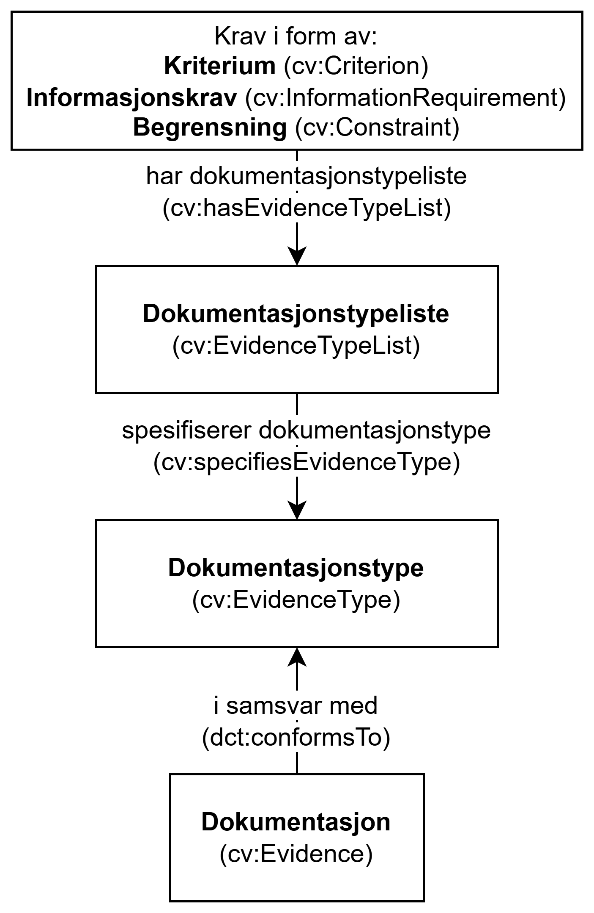

=== Når brukes Dokumentasjon og Dokumentasjonstype/Dokumentasjonstypeliste? [[Når-brukes-dokumentasjon-og-dokumentasjonstype-dokumentasjonstypeliste]]

// ==== Når Dokumentasjon (`cv:Evidence`) brukes [[Når-dokumentasjon-brukes]]

:xrefstyle: short

*Dokumentasjon* (`cv:Evidence`, kap. <<Dokumentasjon>>) brukes til å beskrive _et konkret stykke_  dokumentasjon som bærer _konkrete data_ eller som gir kilden til slike data, som _er brukt_ til å evaluere og dokumentere oppfyllelse av et krav i «_run time_». Et eksempel på en dokumentasjon kan være uttrekk fra Folkeregisteret med opplysninger om søkeren Ola Nordmann, som i et konkret saksbehandlingsøyemed er brukt til å evaluere om han er minst 18 år gammel. 

*Dokumentasjonstype* (`cv:EvidenceType`, kap. <<Dokumentasjonstype>>) brukes, i «_design time_», til å beskrive en type dokumentasjon som _kan brukes_ til å evaluere oppfyllelse av et krav. En dokumentasjonstype bærer altså ingen konkrete data, men spesifiserer felles egenskaper til data som trengs eller kilden til hvor slike data kan finnes. Et eksempel på dokumentasjonstype kan f.eks. være «Folkeregisteropplysninger», dvs. opplysninger registrert i Folkeregisteret som kan brukes til å evaluere om en søker er minst 18 år gammel. En annet eksempel kan være «Pass», som også kan brukes til å evaluere om en søker er minst 18 år gammel. 

For å knytte en dokumentasjonstype til et krav, brukes *Dokumentasjonstypeliste* (`cv:EvidenceTypeList`, kap. <<Dokumentasjonstypeliste>>). En dokumentasjonstypeliste spesifiserer en eller flere typer dokumentasjon som kreves for å oppfylle et krav. Vær spesielt oppmerksom på at kravet om å være i samsvar med en dokumentasjonstypeliste er oppfylt **hvis og bare hvis** den aktuelle dokumentasjonen samsvarer med **alle** typer som listen inneholder. Det er med andre ord en *`OG (_AND_)`* betingelse mellom typene på en gitt dokumentasjonstypeliste, og en *`ELLER (_OR_)`* betingelse mellom ulike dokumentasjonslister. På denne måten kan man også uttrykke alternative dokumentasjonskrav. For eksmepel, for å dokumentere at en søker er 1) minst 18 år gammel og 2) ikke i et ekteskap eller registrert partnerskap, kan man bruke en dokumentasjonstypeliste som inneholder dokumentasjonstypen «Folkeregisteropplysning» (fordi både fødselsdato og sivilstand kan hentes fra Folkeregisteret, for søkere som er registrert i Folkeregisteret), og en annen dokumentasjonstypeliste som inneholder dokumentasjonstypene «Pass» _og_ «Dokumentasjon på at man ikke er i et ekteskap eller registrert partnerskap» (fordi passet bare inneholder fødeselsdato men ikke sivilstand). 

CCCEV-AP-NO gjør det også mulig å knytte en gitt dokumentasjon til en dokumentasjonstype, ved hjelp av egenskapen <<Dokumentasjon-i-samsvar-med, «i samsvar med» (`dct:conformsTo`)>>. For vår søker Ola Nordmann, som er registrert i Folkeregisteret, vil dokumentasjonen «Uttrekk fra Folkeregisteret for Ola Nordmann» tilfredsstille dokumentasjonskravet fordi dokumentasjonen er i samsvar med dokumentasjonstypen «Folkeregisteropplysning». 

Forholdet mellom krav, dokumentasjonstypeliste, dokumentasjonstype og dokumentasjon er beskrvet i <> nedenfor.

[[img-ForholdKravDoktypeDoktypelisteDok]]
.Forholdet mellom Krav, Dokumentasjonstypeliste, Dokumentasjonstype og Dokumentasjon
[link=images/Figur-Krav-doktypeliste-doktype-dokumentasjon.png]

Se også <<Å-beskrive-betingelser-som-skal-oppfylles>> for et illustrativt eksempel på bruk av Krav, Dokumentasjonstypeliste, Dokumentasjonstype og Dokumentasjon.
