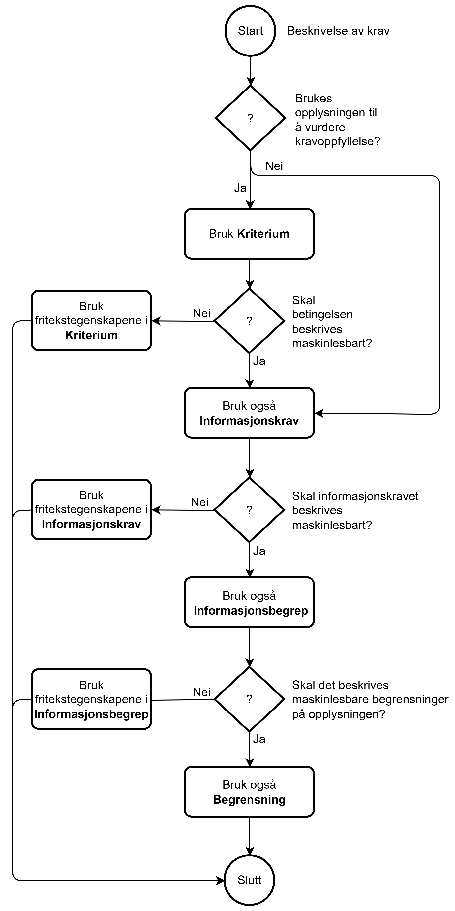

=== Når brukes Kriterium, Informasjonskrav, Informasjonsbegrep og Begrensning? [[Når-brukes-kriterium-informasjonskrav-informasjonsbegrep-begrensning]]

:xrefstyle: short

Ut fra CCCEV sin beskrivelse av klassene *Kriterium* (_Criterion_), *Informasjonskrav* (_Information Requirement_), *Informasjonsbegrep* (_Information Concept_) og *Begrensning* (_Constraint_), samt eksemplene i CCCEV, kan følgende anses som en god praksis for når de ulike klassene bør brukes:

* *Kriterium* (<<Kriterium>>) brukes for å beskrive en eller flere betingelser som må være oppfylt. 
** Bortsett fra type, bias og relativ vekting, gir ikke klassen Kriterium alene mulighet til i maskinlesbar form å beskrive data som trengs for å evaluere om en betingelse er oppfylt eller ikke. Derfor brukes Kriterium sammen med *Informasjonskrav* for å beskrive de nødvendige dataene. 
** Når det ikke er behov for i maskinlesbar form å beskrive data som trengs for å evaluere om en betingelse er oppfylt eller ikke, kan Kriterium brukes alene, ved å bruke fritekstegenskapene <<Kriterium-navn, navn>> og <<Kriterium-beskrivelse, beskrivelse>>. F.eks. navn = «Vilkår for å inngå ekteskap»; beskrivelse = «Den som er under 18 år, kan ikke inngå ekteskap; Ingen kan inngå ekteskap så lenge et tidligere ekteskap eller registrert partnerskap består; ...».

* *Informasjonskrav* (<<Informasjonskrav>>) kan brukes 
for å beskrive data som forespørres (f.eks. «Søkerens alder») og som skal brukes til å evaluere om en betingelse er oppfylt eller ikke, eller for å beskrive data som trengs uten at det brukes til noen evalueringer (f.eks. «Søkerens kontaktopplysninger»).
** Bortsett fra type, gir ikke klassen Informasjonskrav alene mulighet til i maskinlesbar form å beskrive data som forespørres. Derfor brukes Informasjonskrav sammen med *Informasjonsbegrep* for å beskrive de nødvendige dataene. 
*** *Informasjonsbegrep* har en egenskap «uttrykk av forventet verdi» (<<Informasjonsbegrep-uttrykk-av-forventet-verdi>>) som ifølge CCCEV også kan brukes til å oppgi nedre og øvre grense for den forventede verdien i tillegg til forventet datatype. For å øke maskinlesbar presisjon, anbefales det at den kun brukes til å oppgi forventet datatype, f.eks. datatype «heltall» for Informasjonsbegrepet «Alder». Dersom det er behov for å angi begrensninger i form av f.eks. nedre og øvre grense på en forventet verdi av et Informasjonsbegrep, bør klassen *Begrensning* brukes.
** Informasjonskrav kan brukes alene når kravet bare skal beskrives i fritekstform, ved å bruke fritekstegenskapene <<Informasjonskrav-navn, navn>> og <<Informasjonskrav-beskrivelse, beskrivelse>>, f.eks. navn = «Søkerens alder» og beskrivelse = «Søkeren må være minst 18 år gammel».

* *Begrensning* (<<Begrensning>>) brukes for å beskrive en begrensning på et Informasjonsbegrep og skal derfor brukes sammen med et Informasjonsbegrep. F.eks. Informasjonsbegrepet «Alder» kan ha Begrensning «Søkeren må være minst 18 år gammel».

Flytskjemaet i <> nedenfor illustrerer forklaringen ovenfor.

[[img-Figur-beslutningsflyt-krav]]
.Flytskjema for når Kriterium, Informasjonskrav, Informasjonsbegrep og Begrensning bør brukes
[link=images/Flytskjema-kriterium-informasjonskrav-begrensning.png]

//:xrefstyle: pass:[%n %t]
:xrefstyle: full

