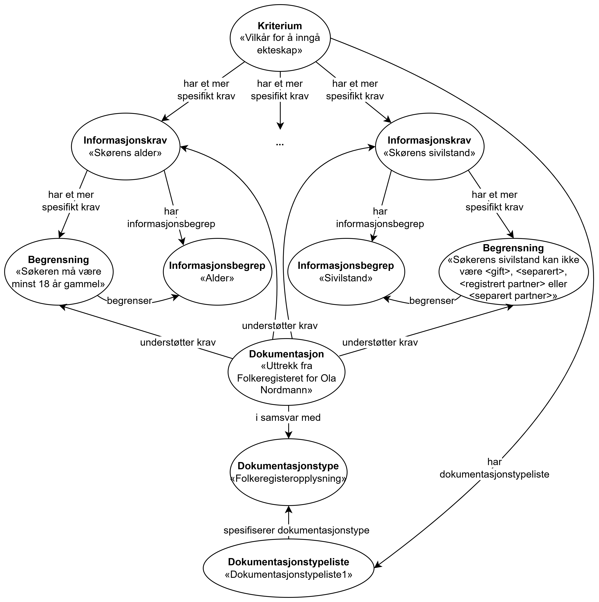

=== Å beskrive betingelser som skal oppfylles [[Å-beskrive-betingelser-som-skal-oppfylles]]

__#@@@@@@ Teksten må oppdateres etter at klassen Påkrevd dokumentasjon er erstattet av Dokumentasjonstypeliste.#__

:xrefstyle: short

CPSV-AP-NO gjør det mulig, i struktuert og maskinlesbar form, å beskrive betingelser som skal oppfylles og dokumentasjon av oppfyllelse.

Følgende er et illustrativt eksempel på bruk av CCCEV-AP-NO for å beskrive «Vilkår for å inngå ekteskap», med beskrivelse av data som trengs samt begrensninger på disse dataene. I eksemplet er det også tatt med påkrevd dokumentasjon og faktisk dokumentasjon som gir kilden til dataene som trengs.

* *Kriterium*: Vilkår for å inngå ekteskap
** *Informasjonskrav* 1: Søkerens alder
*** *Informasjonsbegrep*: Alder
**** *Begrensning*: Søkeren må være minst 18 år gammel
*** *Påkrevd dokumentasjon*: Uttrek fra Folkeregisteret; ...
*** *Dokumentasjon*: Uttrekk fra Folkeregisteret for Ola Nordmann

** *Informasjonskrav* 2: Søkerens sivilstand
*** *Informasjonsbegrep*: Sivilstand
**** *Begrensning*: Søkerens sivilstand kan ikke være <gift>, <separert>, <registrert partner> eller <separert partner>
*** *Påkrevd dokumentasjon*: Uttrek fra Folkeregisteret; ...
*** *Dokumentasjon*: Uttrekk fra Folkeregisteret for Ola Nordmann

** *Informasjonskrav* 3: ...
*** *Informasjonsbegrep*: ...
**** *Begrensning*: ...
*** *Påkrevd dokumentasjon*: 
*** *Dokumentasjon*: ...

Eksemplet er illustrert i <> nedenfor.

[[img-Figur-eksempelbruk-kravsklassene]]
.Eksempel - beskrivelse av «Vilkår for å inngå ekteskap»
[link=images/Figur-eksempelbruk-kravsklassene.png]

Eksemplet i RDF Turtle:
-----
<vilkårForÅInngåEkteskap> a cv:Criterion ; # kriterium
   dct:title "Vilkår for å inngå ekteskap"@nb ; # navn
   cv:hasRequirement <søkerensAlder>, <begrensningAlder>, 
      <søkerensSivilstand>, <begrensningSivilstand> ; # har mer spesifikt krav
   .

<søkerensAlder> a cv:InformationRequirement ;  # informasjonskrav
   dct:title "Søkerens alder"@nb ; # navn
   cv:hasConcept <alder> ; # har informasjonsbegrep
   cv:hasRequirement <begrensningAlder> ; # har mer spesifikt krav
   .

<alder> a cv:InformationConcept ; # informasjonsbegrep
   dct:title "Alder"@nb ; # navn
   .

<begrensningAlder> a cv:Constraint ; # begrensning
   dct:title "Begrensning på søkerens alder"@nb ; # navn
   dct:description "Søkeren må være minst 18 år gammel."@nb ;
   cv:constrains <alder> ; # begrenser
   .

<søkerensSivilstand> a cv:InformationRequirement ;  # informasjonskrav
   dct:title "Søkerens sivilstand"@nb ; # navn
   cv:hasConcept <sivilstand> ; # har informasjonsbegrep
   cv:hasRequirement <begrensningSivilstand> ; # har mer spesifikt krav
   .

<sivilstand> a cv:InformationConcept ; # informasjonsbegrep
   dct:title "Sivilstand"@nb ; # navn
   .

<begrensningSivilstand> a cv:Constraint ; # begrensning
   dct:title "Begrensning på søkerens sivilstand"@nb ; # navn
   dct:description "Søkerens sivilstand kan ikke være <gift>, <separert>, <registrert partner> eller <separert partner>."@nb ;
   cv:constrains <sivilstand> ; # begrenser
   .

<fregUttrekkForOlaNormann> a cv:Evidence ; # en konkret dokumentasjon, for Ola Nordmann 
   dct:title "Uttrekk fra Folkeregisteret for Ola Nordmann"@nb ; # navn
   cv:supportsRequirement <søkerensAlder>, <begrensningAlder>,
      <søkerensSivilstand>, <begrensningSivilstand> ; # understøtter krav
   .

<fregUttrekk> a cccevno:RequiredEvidence ; # påkrevd dokumentasjon
   dct:title "Uttrekk fra Folkeregisteret"@nb ; # navn
   cv:supportsRequirement <søkerensAlder>, <begrensningAlder>, 
      <søkerensSivilstand>, <begrensningSivilstand> ; # understøtter krav
   .
-----

//:xrefstyle: pass:[%n %t]
:xrefstyle: full
