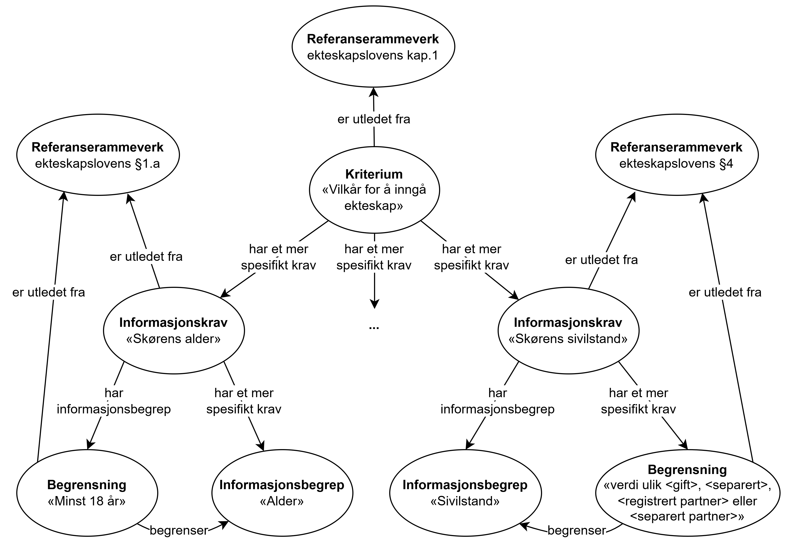

=== Å kytte krav til regelverk [[Å-kytte-krav-til-regelverk]]

CCCEV-AP-NO gir mulighet til å knytte krav til aktuelle regelverk. Følgende eksempel illustrerer at Kriterium «Vilkår for å inngå ekteskap» er utledet fra kapittel 1 i ekteskapsloven, Informasjonskrav «Søkerens alder» med tilhørende begrensning er utleddet fra §1.a i ekteskapsloven, og Informasjonskrav til «Søkerens sivilstand» med tilhørende begrensning er utleddet frac i ekteskapsloven.

* *Kriterium*: Vilkår for å inngå ekteskap
** er utledet fra: kapittel 1 i ekteskapsloven
** *Informasjonskrav* 1: Søkerens alder
*** *Informasjonsbegrep*: Alder
**** *Begrensning*: Søkeren må være minst 18 år gammel
*** er utledet fra: §1.a i ekteskapsloven

** *Informasjonskrav* 2: Søkerens sivilstand
*** *Informasjonsbegrep*: Sivilstand
**** *Begrensning*: Søkerens sivilstand kan ikke være <gift>, <separert>, <registrert partner> eller <separert partner>
*** er utledet fra: §4 i ekteskapsloven

** *Informasjonskrav* 3: ...
*** *Informasjonsbegrep*: ...
**** *Begrensning*: ...
*** *Påkrevd dokumentasjon*: 
*** *Dokumentasjon*: ...

:xrefstyle: short

Eksemplet er illustrert i <> nedenfor.

[[img-FigurEksempelDokumentasjonskrav2]]
.Eksempel på å knytte dokumentasjonskrav til lovgivning.
[link=images/Figur-eksempelbruk-krav-utledet-fra-regelverk.png]

Eksemplet i RDF Turtle:
-----
<vilkårForÅInngåEkteskap> a cv:Criterion ; # kriterium
   dct:title "Vilkår for å inngå ekteskap"@nb ; # navn
   cv:isDerivedFrom <ekteskapsloven1> ; # er utledet fra
   cv:hasRequirement <brukerensAlder>, <begrensningAlder>, 
      <brukerensSivilstand>, <begrensningSivilstand> ; # har mer spesifikt krav
   .

<brukerensAlder> a cv:InformationRequirement ;  # informasjonskrav
   dct:title "Brukerens alder"@nb ; # navn
   cv:isDerivedFrom <ekteskapsloven1a> ; # er utledet fra
   cv:hasRequirement <alder>, <begrensningAlder> ; # har mer spesifikt krav
   .

<alder> a cv:InformationConcept ; # informasjonsbegrep
   dct:title "Alder"@nb ; # navn
   .

<begrensningAlder> a cv:Constraint ; # begrensning
   dct:title "Minst 18 år" ; # navn
   cv:isDerivedFrom <ekteskapsloven1a> ; # er utledet fra
   cv:constrains <alder> ; # begrenser
   .

<brukerensSivilstand> a cv:InformationRequirement ;  # informasjonskrav
   dct:title "Brukerens sivilstand"@nb ; # navn
   cv:hasRequirement <sivilstand>, <begrensningSivilstand> ; # har mer spesifikt krav
   .

<sivilstand> a cv:InformationConcept ; # informasjonsbegrep
   dct:title "Sivilstand"@nb ; # navn
   .

<begrensningSivilstand> a cv:Constraint ; # begrensning
   dct:title "ulik <gift>, <separert>, <registrert partner> eller <separert partner>" ; # navn
   cv:isDerivedFrom <ekteskapsloven4> ; # er utledet fra
   cv:constrains <sivilstand> ; # begrenser
   .

<ekteskapsloven1> a cv:ReferenceFramework ; # referanserammeverk 
   dct:identifier <https://lovdata.no/lov/1991-07-04-47/kapittel-1> ; # identifikator
    .

<ekteskapsloven1a> a cv:ReferenceFramework ; # referanserammeverk 
   dct:identifier <https://lovdata.no/lov/1991-07-04-47/§1a> ; # identifikator
   .

<ekteskapsloven4> a cv:ReferenceFramework ; # referanserammeverk 
   dct:identifier <https://lovdata.no/lov/1991-07-04-47/§4> ; # identifikator
   .
-----

//:xrefstyle: pass:[%n %t]
:xrefstyle: full